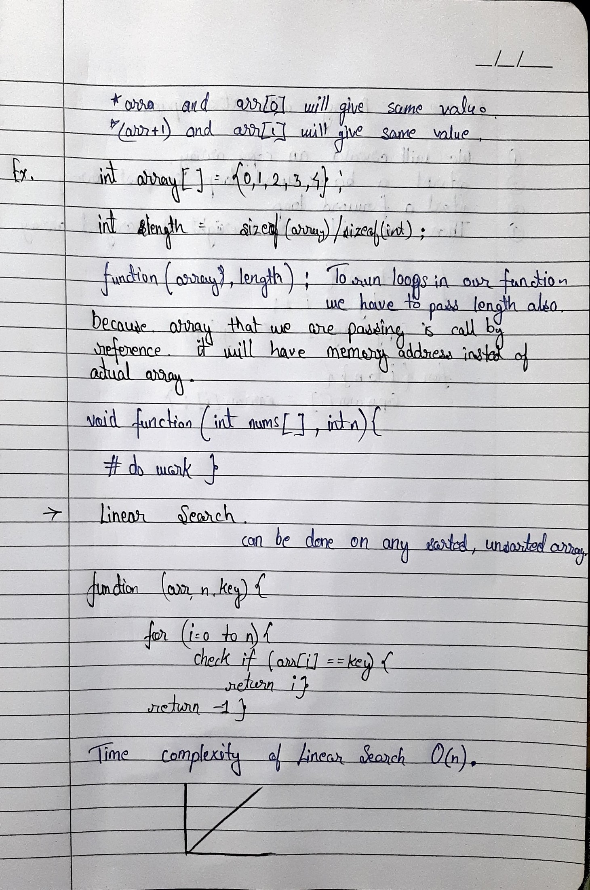
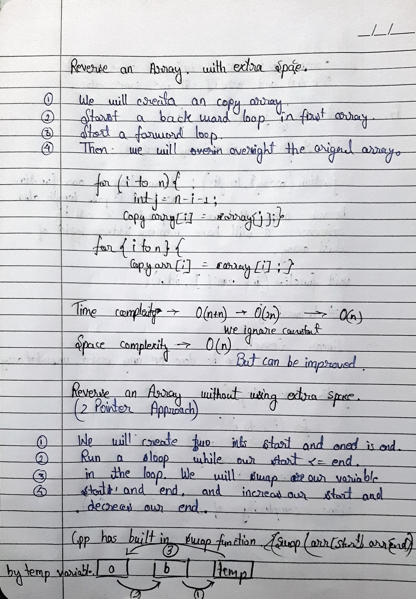

# 📚 Arrays Notes in C++

Basics of arrays in C++.

---

## 📑 Table of Contents
- [📋 Topics Table](#topics-table)
- [📘 Arrays Notes (Image Snapshots)](#-arrays-notes-image-snapshots)

---

## 📋 Topics Table

| 🔹 Topic                                           | 💻 Code                                                                 | 📝 Notes       | 📄 Page |
|---------------------------------------------------|------------------------------------------------------------------------|----------------|---------|
| Creating arrays                                   | [**CODE**](../Arrays/array_01.cpp)                                    | [Notes](#page1) | 1       |
| Length of array                                   | [**CODE**](../Arrays/array_01.cpp)                                    | [Notes](#page1) | 1       |
| I/O in arrays                                     | [**CODE**](../Arrays/array_02.cpp)                                    | [Notes](#page2) | 2       |
| Largest number in array                           | [**CODE**](../../Day01/solutions/largest.cpp)                         | [Notes](#page2) | 2       |
| Arrays passed as reference                        | [**CODE**](../Arrays/array_03.cpp)                                    | [Notes](#page2) | 2       |
| Linear search                                     | [**CODE**](../Arrays/array_04.cpp)                                    | [Notes](#page3) | 3       |
| Reverse of array with extra space                 | [**CODE**](../../Day01/solutions/reversewithsp.cpp)                   | [Notes](#page4) | 4       |
| Reverse of array without using extra space        | [**CODE**](../../Daily/Day02/solutions/reversewithoutsp.cpp)         | [Notes](#page4) | 4       |
| Binary search                                     | [**CODE**](../Arrays/array_05.cpp)                                    | [Notes](#page5) | 5       |
| Array pointers & pointer arithmetic               | [**CODE**](../Arrays/array_06.cpp)                                    | [Notes](#page6) | 6       |
| Printing subarrays                                | [**CODE**](../Arrays/array_07.cpp)                                    | [Notes](#page7) | 7       |
| Maximum subarray sum (Brute Force Approach)       | [**CODE**](../../dsacpp-journal/Daily/Day03/solutions/maxsasum1.cpp) | [Notes](#page8) | 8       |
| Maximum subarray sum (Optimized Approach)         | [**CODE**](../../dsacpp-journal/Daily/Day03/solutions/maxsasum2.cpp) | [Notes](#page9) | 9       |
| Maximum subarray sum (Kadane's Algorithm)         | [**CODE**](../../dsacpp-journal/Daily/Day03/solutions/maxsasum3.cpp) | [Notes](#page9) | 9       |
| Best Time to Buy & Sell Stocks                    | [**CODE**](../../dsacpp-journal/Daily/Day04/solutions/buySellStocks.cpp) | [Notes](#page10) | 10      |
| Trapping Rainwater                                | [**CODE**](../../dsacpp-journal/Daily/Day05/solutions/trappingRainwater.cpp) | [Notes](#page11) | 11      |

---

## 📘 Arrays Notes (Image Snapshots)

### <h3 id="page1">📄 Page 1</h3>

### <h3 id="page2">📄 Page 2</h3>

### <h3 id="page3">📄 Page 3</h3>

### <h3 id="page4">📄 Page 4</h3>

### <h3 id="page5">📄 Page 5</h3>

### <h3 id="page6">📄 Page 6</h3>

### <h3 id="page7">📄 Page 7</h3>

### <h3 id="page8">📄 Page 8</h3>

### <h3 id="page9">📄 Page 9</h3>

### <h3 id="page10">📄 Page 10</h3>

### <h3 id="page11">📄 Page 11</h3>

Copyright © 2025 Tushar Thakur  
Licensed under the Creative Commons Attribution-NonCommercial-NoDerivatives 4.0 International License (CC BY-NC-ND 4.0).  

You may share these handwritten notes for educational purposes **with proper credit**.  
However, you may not modify, sell, or redistribute them in any altered form.

For inquiries or permission requests, contact: **https://linkedin.com/in/tushar0i**  
To view a copy of this license, visit: https://creativecommons.org/licenses/by-nc-nd/4.0/

<h3 align="left">Connect with me:</h3>

  
  
  
  
  
  
  

