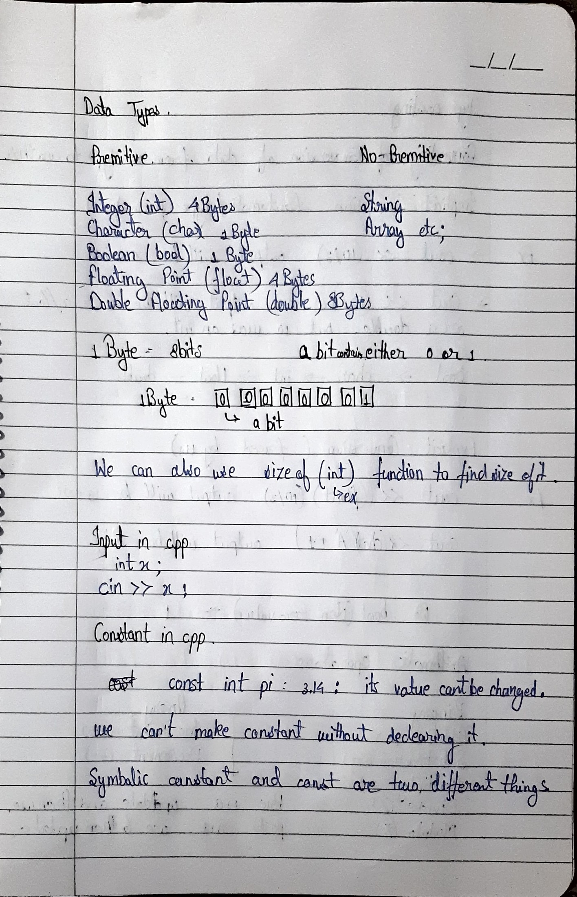
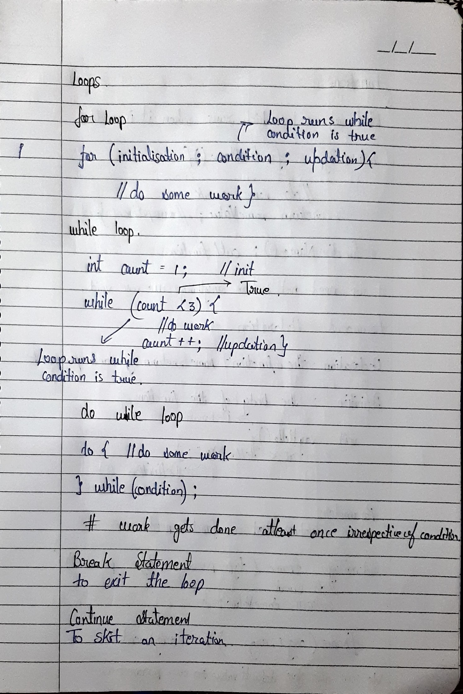
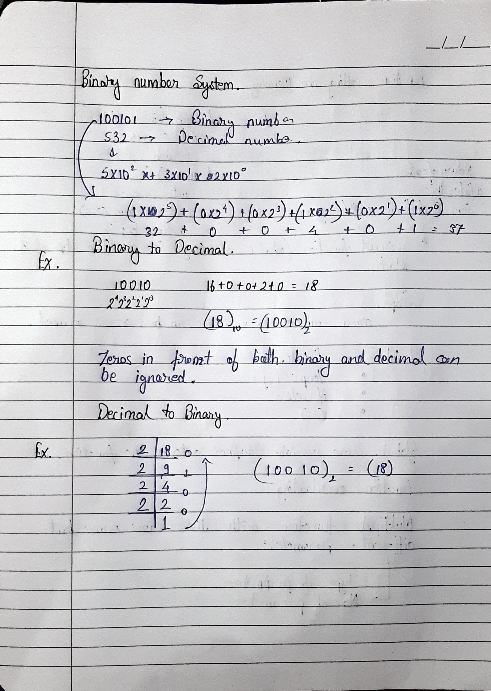
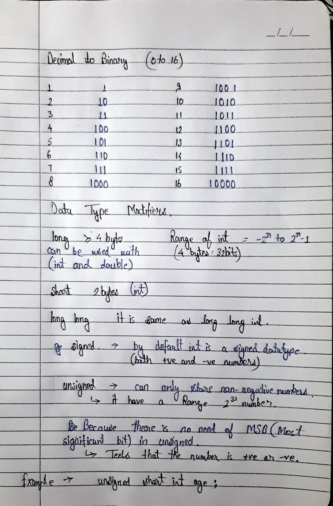

# 🧠 C++ Basics Notes

## Topics:
- I/O
- Variables
- Data types
- Operators
- Conditional Statements
- Loops
- Functions
- Binary Number System

<h2>📘 C++ Basics Notes (Image Snapshots)</h2>

<h3>📄 Page 1</h3>

<h3>📄 Page 2</h3>

<h3>📄 Page 3</h3>

<h3>📄 Page 4</h3>

<h3>📄 Page 5</h3>

<h3>📄 Page 6</h3>

<h3>📄 Page 7</h3>

<h3>📄 Page 8</h3>

<h3>📄 Page 9</h3>

<h3>📄 Page 10</h3>

<h3>📄 Page 11</h3>

© Tushar Thakur 2025. All rights reserved.

This work is licensed under CC BY-NC-ND 4.0. You may share this image with proper credit, but not modify it or use it commercially. © Tushar Thakur 2025. For inquiries: **Email**: [tusharthakur.dev@gmail.com](mailto:tusharthakur.dev@gmail.com)