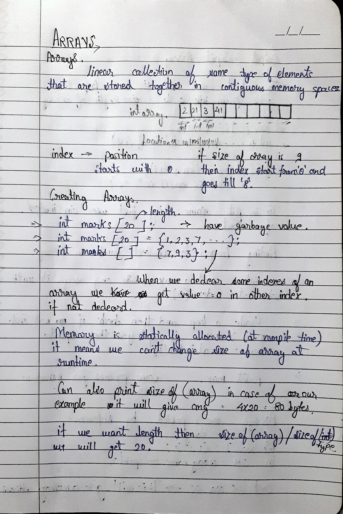
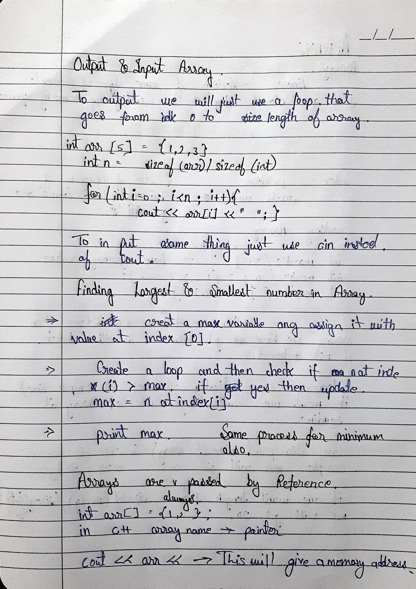
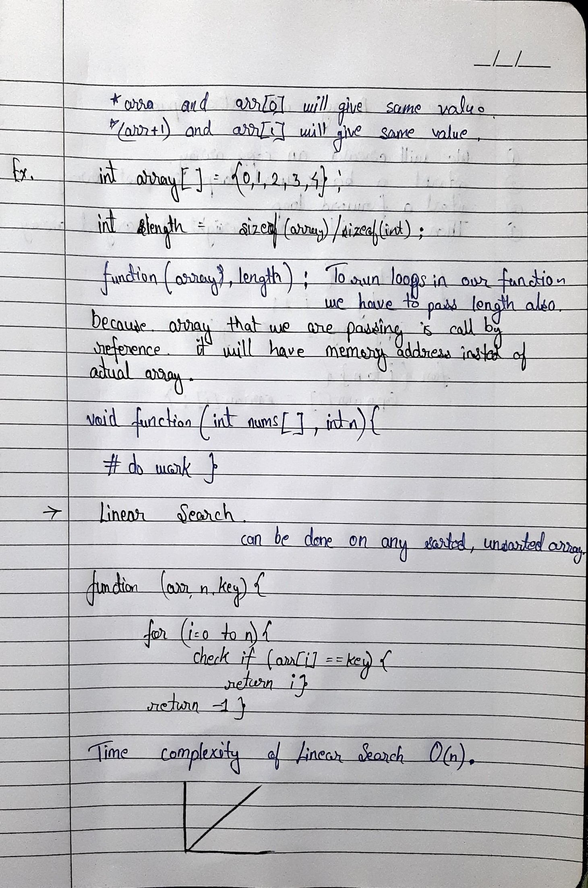
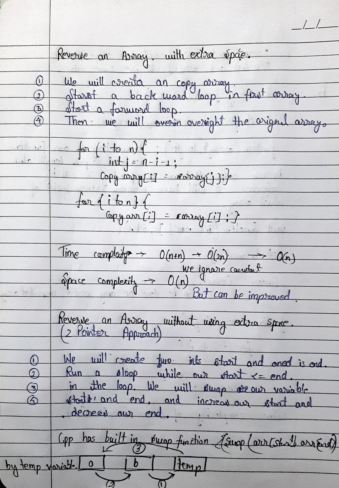
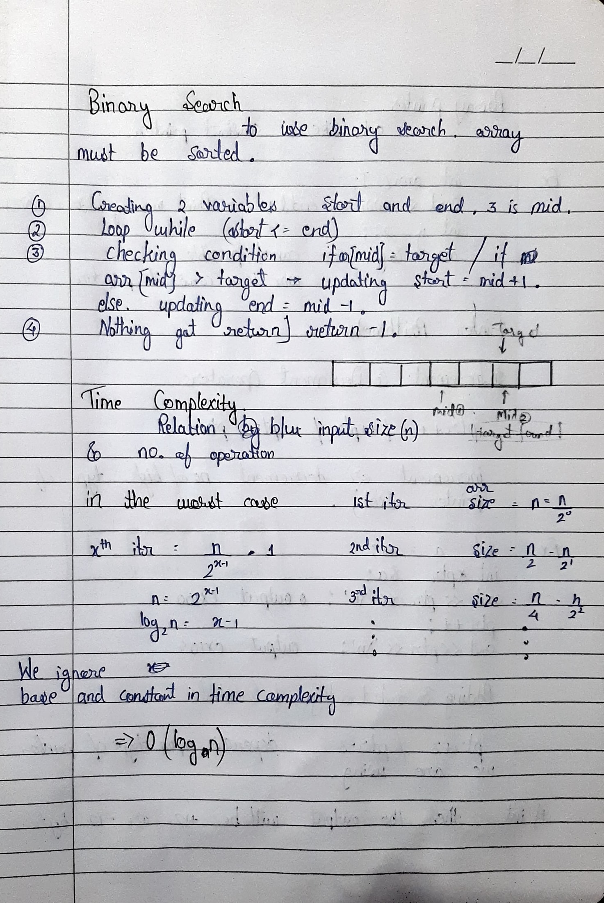
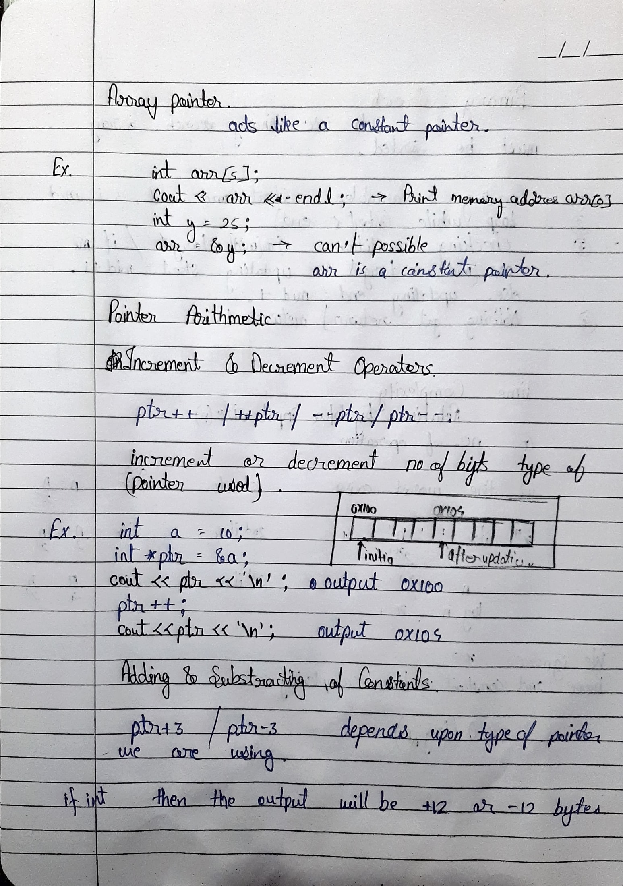

# 📚 Arrays Notes

Basics of arrays in C++.

## Topics:
- Creating arrays → <a href="../Arrays/array_01.cpp">**CODE**</a> | <a href="#page1">📄 Page 1</a>
- Length of array → <a href="../Arrays/array_01.cpp">**CODE**</a> | <a href="#page1">📄 Page 1</a>
- I/O in arrays → <a href="../Arrays/array_02.cpp">**CODE**</a> | <a href="#page2">📄 Page 2</a>
- Largest number in array → <a href="../../Day01/solutions/largest.cpp">**CODE**</a> | <a href="#page2">📄 Page 2</a>
- Arrays passed as reference → <a href="../Arrays/array_03.cpp">**CODE**</a> | <a href="#page2">📄 Page 2</a>
- Linear search → <a href="../Arrays/array_04.cpp">**CODE**</a> | <a href="#page3">📄 Page 3</a>
- Reverse of array with extra space → <a href="../../Day01/solutions/reversewithsp.cpp">**CODE**</a> | <a href="#page4">📄 Page 4</a>
- Reverse of array without using extra space → <a href="../../Daily/Day02/solutions/reversewithoutsp.cpp">**CODE**</a> | <a href="#page4">📄 Page 4</a>
- Binary search → <a href="../Arrays/array_05.cpp">**CODE**</a> | <a href="#page5">📄 Page 5</a>
- Array pointers & pointer Arithmetic → <a href="../Arrays/array_06.cpp">**CODE**</a> | <a href="#page6">📄 Page 6</a>

## 📘 Arrays Notes (Image Snapshots)

<h3 id="page1">📄 Page 1</h3>

<h3 id="page2">📄 Page 2</h3>

<h3 id="page3">📄 Page 3</h3>

<h3 id="page4">📄 Page 4</h3>

<h3 id="page5">📄 Page 5</h3>

<h3 id="page6">📄 Page 6</h3>

Copyright © 2025 Tushar Thakur  
Licensed under the Creative Commons Attribution-NonCommercial-NoDerivatives 4.0 International License (CC BY-NC-ND 4.0).  

You may share these handwritten notes for educational purposes **with proper credit**.  
However, you may not modify, sell, or redistribute them in any altered form.

For inquiries or permission requests, contact: **https://linkedin.com/in/tushar0i**  
To view a copy of this license, visit: https://creativecommons.org/licenses/by-nc-nd/4.0/

<h3 align="left">Connect with me:</h3>

  
  
  
  
  
  
  

