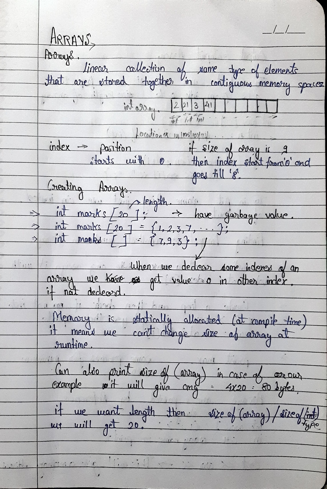
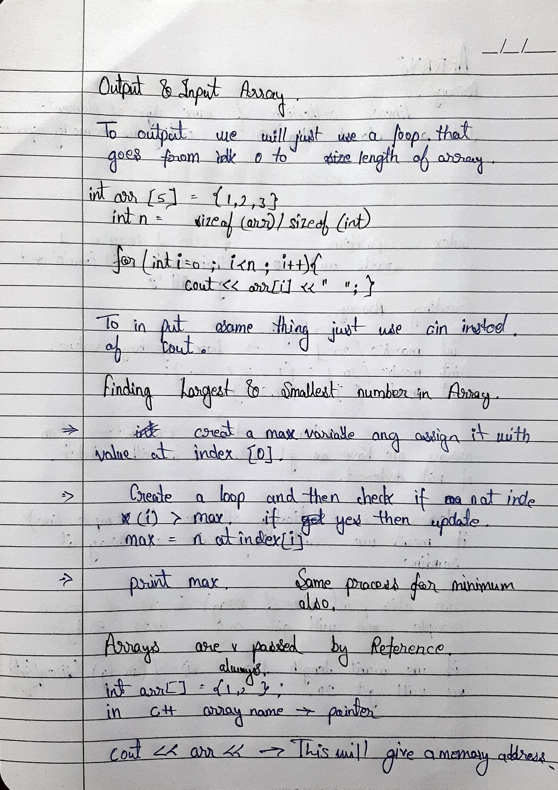

# 📚 Arrays Notes

Basics of arrays in C++.

## Topics:
- Creating arrays
- Length of array
- I/O in arrays
- Largest number in array -> <a href="../../Day01/solutions/largest.cpp">**CODE**</a>
- Arrays passed as reference
- Linear search
- Reverse of array with extra space -> <a href="../../Day01/solutions/reversewithsp.cpp">**CODE**</a>

<h2>📘 Arrays Notes (Image Snapshots)</h2>

<h3>📄 Page 1</h3>

<h3>📄 Page 2</h3>

<h3>📄 Page 3</h3>

<h3>📄 Page 4</h3>
